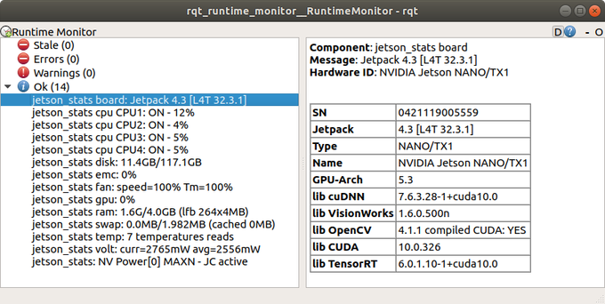

# ROS jetson-stats

A ROS wrapper [jetson-stats](https://github.com/rbonghi/jetson_stats) to ROS where you can read the status of your board via diagnostic messages.

# Installation

1. Check your NVIDIA board have insalled jetson-stats otherwise install it
```elm
sudo -H pip install -U jetson-stats
```
2. Clone this repository in your workspace
3. Run catkin_make to locate `ros_jetson_stats` in your workspace

## Setup your launch file

Add in your launch file the `ros_jetson_stats` package following
```xml
<node pkg="ros_jetson_stats" type="jetson_stats.py" name="ros_jetson_stats"/>
```

# Run the demo

Run the demo following this roslaunch file
```elm
roslaunch ros_jetson_stats jetson_stats.launch
```
Wath your NVDIA Jetson stats from your runtime_monitor
```elm
rosrun rqt_runtime_monitor rqt_runtime_monitor
```
